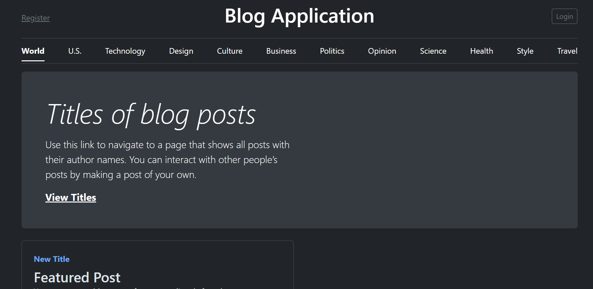

# BLog Web Application

## ✏️ Description
A full-featured learning log web application built with Django.
It allows users to register, create topics, and add summaries under each topic — helping you track your learning progress over time.

## 🔗 Live Demo
[Visit BLog App](https://master-7rqtwti-hjeujhvatkitm.eu-5.platformsh.site/)

## 📸 Screenshots


## 🚀 Installation

### 1️⃣ Clone the Repository
```bash
git clone https://github.com/yourusername/blog.git
cd blog
```
**💡 Note for beginners: You can use GitHub Desktop to make this process easier.**

### 2️⃣ Create a Virtual Environment

1. Open Terminal or Command Prompt.
2. Change directory to your project folder.
> Run:
```bash
python -m venv env
```
Activate it:
> macOS/Linux:
```bash
source env/bin/activate
```
Windows:
```bash
env\Scripts\activate
```
***⚙️ Tip: env is just the environment name — you can use any name, but stay consistent.***

### 3️⃣ Install Dependencies
```bash
pip install -r requirements.txt
```

### 4️⃣ Run Migrations
```bash
python manage.py migrate
```

### 5️⃣ Start the Development Server
```bash
python manage.py runserver
```

### ✨ Features
> User registration & authentication
> Create and edit log topics
> Add, edit, and delete blogs
> Responsive design with Bootstrap
> All blog Are publicly available you edit them

### 🛠️ Tech Stack

Python & Django
HTML5, CSS3, Bootstrap
SQLite (default)

## 📄 License
This project is licensed under the MIT License.

## 🤝 Contributing
Pull requests are welcome!
Feel free to fork this repo and submit a PR.

## 📬 Contact
Have questions or suggestions?
Open an Issue.